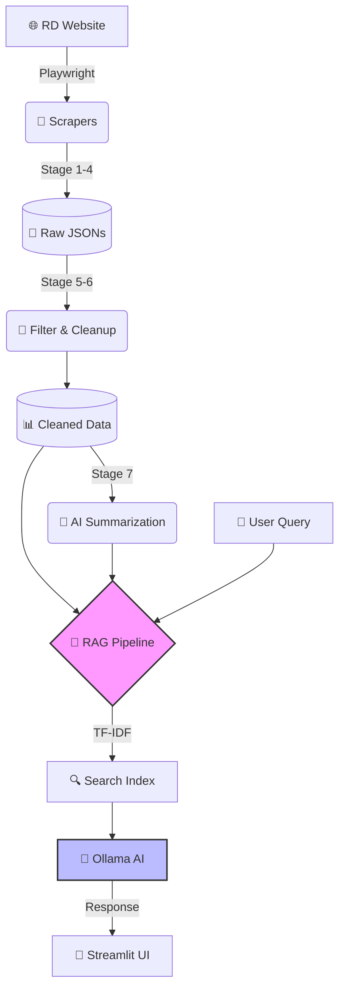
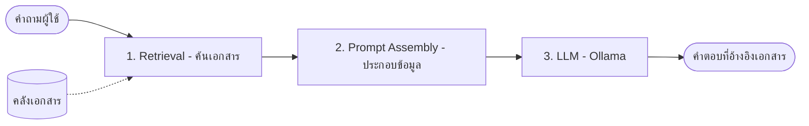

# ⚖️ กองกฎหมาย - RPA RD Scraper & ChatBot

> [!NOTE]
> **Refactored & Enhanced Version**: ระบบรวบรวมข้อมูลเอกสารข้อหารือภาษีอากรจากเว็บไซต์กรมสรรพากร (RD) และ ChatBot อัจฉริยะที่ช่วยตอบคำถามโดยอ้างอิงจากฐานข้อมูลจริง (RAG)

---

## 🌟 ภาพรวมระบบ (System Overview)

โปรเจกต์นี้ถูกออกแบบมาเพื่ออำนวยความสะดวกในการสืบค้นข้อหารือภาษี โดยแบ่งการทำงานออกเป็น 2 ส่วนหลักที่เชื่อมโยงกัน:

1. **🕷️ RPA Pipeline (Scraper)**: ใช้ Playwright ในการดึงข้อมูลจากเว็บสรรพากรแบบทีละขั้นตอน (Stage-by-Stage)
2. **🧠 RAG Pipeline (AI ChatBot)**: นำข้อมูลที่ได้มาทำดัชนีและใช้ **Ollama (Qwen3)** ในการวิเคราะห์และสรุปคำตอบ

### 🏗️ สถาปัตยกรรมทางเทคนิค (Technical Architecture)



---

## 🛠️ การติดตั้ง (Detailed Setup Guide)

> [!IMPORTANT]
> กรุณาติดตั้งเครื่องมือตามลำดับเพื่อให้ระบบทำงานได้อย่างสมบูรณ์

### 1. 🐍 สภาพแวดล้อม (Environment)

แนะนำให้ใช้ **Conda** เพื่อการจัดการ Library ที่แม่นยำ:

```bash
# สร้าง Environment จากไฟล์ config
rcc venv create conda.yaml

# หรือใช้ pip ปกติ
pip install -r requirements.txt
```

### 2. 🤖 ติดตั้ง Ollama (AI Engine)

1. ดาวน์โหลดที่ [ollama.com](https://ollama.com/)
2. ดึงโมเดลหลักมาใช้งาน:

   ```bash
   ollama pull qwen3:8b
   ```

---

## 🚀 ขั้นตอนการทำงาน (Step-by-Step Operation)

### 📋 ส่วนที่ 1: การเตรียมข้อมูล (RPA Pipeline)

คุณต้องรัน Task ตามลำดับเพื่อให้ข้อมูลมีความสมบูรณ์ที่สุด:

| Stage | Task Name | รายละเอียดเชิงลึก | ผลลัพธ์ |
| :-- | :--- | :--- | :--- |
| **1** | `run_year` | เก็บรายการปีทั้งหมด | `years.json` |
| **2** | `run_month` | เก็บรายการเดือนตามปี | `months.json` |
| **3** | `run_collect_month_urls_task` | รวบรวมลิงก์เอกสาร | `month_document_urls.json` |
| **4** | `run_read_document_content_task` | **(Heavy)** ดึงเนื้อหาเชิงลึก | `month_document_contents.json` |
| **5** | `run_filter_documents_task` | กรองข้อมูลขยะ/ฟิลด์ว่าง | `..._filtered.json` |
| **6** | `run_filter_documents_by_title_task`| กรองตาม Keyword พิเศษ | `..._filtered.json` |
| **7** | `run_summarize_filtered_documents_task` | **AI** สรุปเนื้อหาสำคัญ | `..._summary.json` |

> [!TIP]
> **Optimization**: สำหรับการทดสอบเบื้องต้น คุณสามารถจำกัดจำนวนเอกสารได้ที่ตัวแปร `max_docs_per_month` ในไฟล์ `settings.py`

### 💬 ส่วนที่ 2: การสนทนา (ChatBot UI)

เมื่อขั้นตอนข้างต้นเสร็จสิ้น สามารถเริ่มใช้งานหน้าเว็บได้ทันที:

```bash
streamlit run app.py
```

---

## 🧠 เจาะลึกระบบ RAG (Deep Dive into RAG Pipeline)

> [!TIP]
> **Big Picture**: โค้ดนี้คือ RAG Pipeline (Retrieval-Augmented Generation) แบบคลาสสิกที่เน้นความแม่นยำและตรวจสอบได้ (Explainable AI)

### ❗ จุดสำคัญที่ต้องทราบ

โมเดล LLM ไม่ได้รู้ทุกอย่างเอง แต่เรา **"บังคับให้มันตอบจากเอกสารของเราเท่านั้น"** เพื่อป้องกันการมโน (Hallucination)



### 🔬 เทคนิคที่เลือกใช้

| ขั้นตอน | เทคนิค / โมเดล | เหตุผลที่เลือก |
| :--- | :--- | :--- |
| **Retrieval** | **TF-IDF + Cosine Similarity** | ทำงานภาษาไทยได้ดี (Character N-gram), เร็ว, และ Offline 100% |
| **Generation** | **Ollama (Qwen3/Llama3)** | ควบคุมความเป็นส่วนตัวได้ดี และรันในเครื่องได้ (Local LLM) |

---

## 🛠️ อธิบายการทำงานแยกตามส่วน (Code Breakdown)

````carousel
```python
# SECTION 1: Preparation
# แปลง JSON -> Chunks ที่ค้นหาได้
search_text = f"{title} {ข้อหารือ} {แนววินิจฉัย}"
```
**จุดเด่น**: รวม Field สำคัญเข้าด้วยกันเพื่อเพิ่ม Recall ในการค้นหา (TF-IDF เข้าใจพื้นผิวของคำได้ดีขึ้น)
<!-- slide -->
```python
# SECTION 2: Search Engine
# ใช้ TfidfVectorizer(analyzer="char_wb", ngram_range=(2, 4))
scores = cosine_similarity(q_vec, matrix)
```
**จุดเด่น**: ใช้ Character N-gram เพื่อทนต่อคำสะกดผิดและคำราชการที่ยาว พร้อมระบบ **Cache (.pkl)** เพื่อความเร็ว
<!-- slide -->
```python
# SECTION 3: LLM Hygiene
# Temperature: 0.3 (Conservative)
# บังคับตอบจากบริบท (Grounded Response)
```
**จุดเด่น**: ใช้ Temp ต่ำเพื่อป้องกันการแต่งเรื่อง (Hallucination) และมี Layer ทำความสะอาดคำตอบ (Clean Answer)
````

### 🛡️ กฎเหล็กของ Pipeline
>
> [!IMPORTANT]
> **1. Domain Detection**: มีการตรวจจับคำค้นหา (เช่น "VAT") เพื่อใช้ในการทำ Analytics ในอนาคต
> **2. Threshold Guard**: หากคะแนนความคล้ายคลึงต่ำกว่า `0.05` ระบบจะกล้าบอกว่า **"ไม่พบข้อมูล"** ดีกว่าเดาสุ่ม
> **3. Prompt Engineering**: โครงสร้างประกอบด้วย Systems (กฎ), Context (เอกสารอ้างอิง), และ User (คำถาม) ตาม Best Practice

---

## ⚙️ การตั้งค่าขั้นสูง (Configuration)

> [!TIP]
> แก้ไขตัวแปรต่างๆ ได้ที่ `src/config/settings.py`

| หมวดหมู่ | ตัวแปร | คำอธิบาย |
| :--- | :--- | :--- |
| **Scraper** | `page_timeout` | เวลารอโหลดหน้าเว็บ (20s) |
| **AI** | `model` | ชื่อโมเดลที่ต้องการ (default: qwen3:8b) |
| **RAG** | `top_k` | จำนวนเอกสารที่ใช้อ้างอิง (default: 2) |
| **RAG** | `strict_mode` | โหมดตอบเฉพาะข้อมูลที่มั่นใจเท่านั้น |

---

## � โครงสร้างโปรเจกต์ (Project Structure)

````carousel
```text
src/
├── config/       # ⚙️ Settings & URL
├── scrapers/     # 🕷️ Playwright Engines
├── rag/          # 🧠 AI & Vector Logic
└── utils/        # 🛠️ Helpers & Cleanup
```
<!-- slide -->
```text
output/
├── years.json    # List of years
├── months.json   # List of months
└── ...           # Final contents
```
````

---

## ❓ การแก้ไขปัญหา (Troubleshooting)

> [!WARNING]
> หากพบปัญหาในการใช้งาน กรุณาตรวจสอบหัวข้อเหล่านี้

* 🚩 **Ollama Connection**: ตรวจสอบว่าแอป Ollama เปิดอยู่หรือไม่
* 🚩 **Timeout**: หากเน็ตช้า ให้ปรับ `page_timeout` เพิ่มขึ้น
* 🚩 **Module Error**: ตรวจสอบการเลือก Python Interpreter ให้ตรงกับ virtual environment
* 🚩 **Selectors**: หากเว็บกรมสรรพากรเปลี่ยนหน้าตา ให้ตรวจสอบ selectors ใน `settings.py`

---
> [!NOTE]
> **จัดทำโดย**: นักศึกษาฝึกสหกิจศึกษา มหาวิทยาลัยสงขลานครินทร์
> สาขาเทคโนโลยีสารสนเทศ(ต่อเนื่อง) รหัสนักศึกษา 6710210469
